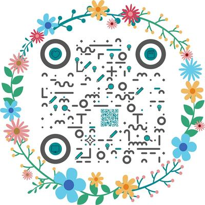

### Oligei 🌈

一个非典型互联网打工人，一个不穿格子衫的人工智障程序员，一个执着于时尚的足球爱好者:snowman:

Currently working on 👉 **Plugin** & **OP optimization** 👣

📜👩🏻‍💻💬 **Personal blog**: [cnblogs.com/nanmi/](https://www.cnblogs.com/nanmi/)

📓📖📃 **Zhihu**: [assinsics](https://www.zhihu.com/people/job-nicer)

   
   

<!--

Or subscribe me on weibo: 

-->